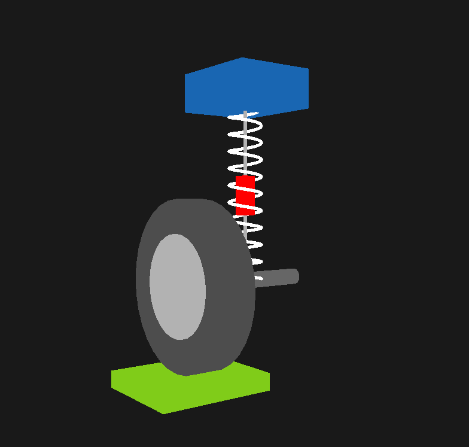
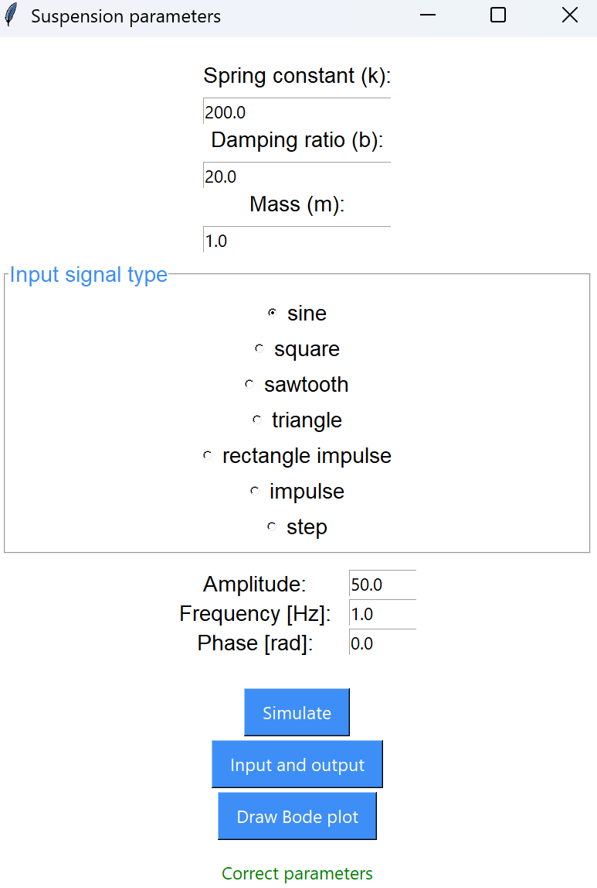

# Projekt z Programowania Obiektowego i Grafiki Komputerowej
## System amortyzacji samochodowej wraz ze stacją diagnostyczną wymuszającą drgania
Celem projektu jest stworzenie systemu amortyzacji samochodowej pozwalającej na zmiany parametrów takich jak waga, współczynnik sprężystości sprężyny, współczynnik tłumika oraz platformy wprawiającej układ w drgania (do wyboru różne pobudzenia). Dodatkowo ilustracja stabilności układu za pomocą charakterystych Bodego. Graficznie przedstawione tylne koło samochodu.
#### Założenia: 
Język programowania - Python

Użyte biblioteki:
- OpenGL - wizualizacja 3D systemu
- pygame - wyświetlenie okna
- scipy - obliczenia, równania różniczkowe, transmitancja
- matplotlib - wykresy pozycji układu i stabilności

#### Wygląd okna symulacji

 
#### Wygląd okna z wyborem parametrów

